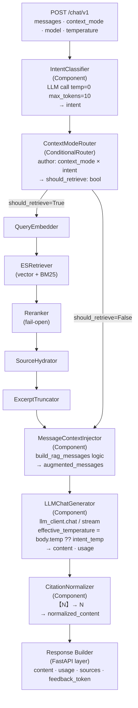

# Chat Intent 處理機制設計文件

> 更新日期：2026-05-27  
> 對應實作追蹤：`docs/00_plan_done.md` Track T-CH、Track T-CH2（已完成）

---

## 1. Intent 分類表

Intent 由輕量 LLM 呼叫（`temperature=0, max_tokens=10`）分類，單一標籤輸出。

| Intent | 說明 | 範例 |
|---|---|---|
| `GREETING` | 打招呼、道別、禮貌用語 | "你好"、"謝謝"、"掰掰" |
| `CHITCHAT` | 閒聊、情緒表達、創作（非文件依賴） | "今天心情不好"、"請寫一首詩" |
| `QUESTION` | 需從文件查找事實的問句 | "XXX 的退款政策是什麼？" |
| `SUMMARY` | 摘要文件內容 | "幫我總結這份合約" |
| `GENERATION` | **以文件為依據**草擬文字 | "根據合約條款，幫我寫一份回覆" |

> **GENERATION 定義邊界**：必須依賴文件的內容才能完成。開放式創作（詩、故事、笑話）→ 歸類為 `CHITCHAT`。

---

## 2. `context_mode` × `intent` 完整矩陣

`context_mode` 由 caller 在 request body 指定（預設 `"auto"`）。

| context_mode | intent | retrieval 是否執行 | inject\_context | system prompt | temperature (auto) | sources 回傳值 | [N] citation |
|---|---|:---:|:---:|---|:---:|---|:---:|
| `auto` | GREETING | ❌ | `False` | `_PLAIN_ASSISTANT` | 0.8 | `null` | ❌ |
| `auto` | CHITCHAT | ❌ | `False` | `_PLAIN_ASSISTANT` | 0.8 | `null` | ❌ |
| `auto` | QUESTION | ✅ | `True` | `_DEFAULT_RAG` | 0.2 | `[{...}]` or `[]` | ✅ |
| `auto` | SUMMARY | ✅ | `True` | `_DEFAULT_RAG` | 0.2 | `[{...}]` or `[]` | ✅ |
| `auto` | GENERATION | ✅ | `True` | `_DEFAULT_RAG` | 0.7 | `[{...}]` or `[]` | ✅ |
| `caller` | GREETING | ❌ | `False` | `_PLAIN_ASSISTANT` | 0.8 | `null` | ❌ |
| `caller` | CHITCHAT | ❌ | `False` | `_PLAIN_ASSISTANT` | 0.8 | `null` | ❌ |
| `caller` | QUESTION | ❌ | `False` | `_RAG_NO_CITATION` | 0.2 | `null` | ❌ |
| `caller` | SUMMARY | ❌ | `False` | `_RAG_NO_CITATION` | 0.2 | `null` | ❌ |
| `caller` | GENERATION | ❌ | `False` | `_RAG_NO_CITATION` | 0.7 | `null` | ❌ |
| `force` | GREETING | ✅ | `True` | `_DEFAULT_RAG` | 0.8 | `[{...}]` or `[]` | ✅ |
| `force` | CHITCHAT | ✅ | `True` | `_DEFAULT_RAG` | 0.8 | `[{...}]` or `[]` | ✅ |
| `force` | QUESTION | ✅ | `True` | `_DEFAULT_RAG` | 0.2 | `[{...}]` or `[]` | ✅ |
| `force` | SUMMARY | ✅ | `True` | `_DEFAULT_RAG` | 0.2 | `[{...}]` or `[]` | ✅ |
| `force` | GENERATION | ✅ | `True` | `_DEFAULT_RAG` | 0.7 | `[{...}]` or `[]` | ✅ |

> **`force` + `GREETING/CHITCHAT`**：retrieval 執行並注入 context；_DEFAULT_RAG prompt 的 Rule 1 已處理 GREETING 情境（warm reply, no context restriction），行為合理。此 mode 為 power-user / debug 用途，預期不常見。

### sources 值語意（修正版）

| 值 | 語意 | 觸發條件 |
|---|---|---|
| `[{...}]` | retrieval 執行且有命中文件 | skip_retrieve=False + docs 非空 |
| `[]` | retrieval 執行但無命中 | skip_retrieve=False + docs 為空 |
| `null` | retrieval 未執行（被跳過） | skip_retrieve=True（context_mode=caller 或 intent=GREETING/CHITCHAT） |

> **語意理由**：`null` = "沒有 retrieval 這件事發生"；`[]` = "有問過，但沒有找到"。兩者對 caller 的後續處理有不同含義（UI 顯示、fallback 策略等）。  
> **實作影響**：`_build_sources` 需改為 `[] if not docs else [...]`；router 中 skip_retrieve=True → `sources = None`。

---

## 3. context_mode 語意

| context_mode | 說明 | 使用時機 |
|---|---|---|
| `auto` | 由 intent 決定是否 retrieve（預設） | 一般問答、多輪對話 |
| `caller` | 永遠跳過 retrieval；caller 在 user message 自帶 `<context>…</context>` | 前端自行檢索後送進來；外部系統代入上下文 |
| `force` | 永遠執行 retrieval，無論 intent 為何 | 除錯、確保 RAG grounding 的特殊場景 |

---

## 4. System Prompt 三種常數

| 常數 | 適用條件 | 有無 [N] citation 規則 | 有無 grounding 規則 |
|---|---|:---:|:---:|
| `_PLAIN_ASSISTANT_PROMPT` | `inject_context=False` + GREETING/CHITCHAT | ❌ | ❌ |
| `_DEFAULT_RAG_SYSTEM_PROMPT` | `inject_context=True` | ✅ | ✅ |
| `_RAG_GROUNDING_NO_CITATION` | `inject_context=False` + QUESTION/SUMMARY/GENERATION | ❌ | ✅ |

> **選擇邏輯**（`build_rag_messages`）：
> ```
> if intent in {GREETING, CHITCHAT} and not inject_context → _PLAIN_ASSISTANT_PROMPT
> elif inject_context                                       → _DEFAULT_RAG_SYSTEM_PROMPT (或 _RAG_GROUNDING_RULES 若 caller 有 sys msg)
> else                                                      → _RAG_GROUNDING_NO_CITATION
> ```

---

## 5. Temperature 策略

`body.temperature` 為 `float | None`（預設 `None`）：
- `None` → 使用 `_INTENT_TEMPERATURE[intent]`（intent-based auto）
- `float` → 直接使用 caller 指定值（覆蓋 intent-based）

| Intent | 預設 temperature | 設計理由 |
|---|---|---|
| GREETING | 0.8 | 對話自然、帶溫度 |
| CHITCHAT | 0.8 | 閒聊需創意與變化 |
| QUESTION | 0.2 | 事實查詢需嚴謹、低發散 |
| SUMMARY | 0.2 | 摘要需忠實原文 |
| GENERATION | 0.7 | 草擬文字兼顧流暢與基礎依賴 |

---

## 6. Citation 格式強制

### 兩層保障

| 層次 | 機制 | 可靠度 |
|---|---|---|
| Prompt ban | Rule 3 明示禁用 `【N】`、`(N)`、`[#N]`，附正反範例 | ～80%（LLM 有時飄移） |
| Output post-processing | `【N】→[N]` regex normalize，在 router 回傳前執行 | 100% 確定 |

### 正規化規則

```python
import re
_CITATION_FULLWIDTH_RE = re.compile(r'【(\d+)】')

def _normalize_citations(text: str) -> str:
    """Normalize full-width citation brackets 【N】→[N]."""
    return _CITATION_FULLWIDTH_RE.sub(r'[\1]', text)
```

> `(N)` 不做自動 normalize，避免誤改正文中的合法有序清單。

---

## 7. Context 注入位置

**注入 user message**（via `_wrap_last_user()`），不注入 system message。

- System message = **instructions**（靜態，告訴 LLM 怎麼行為）
- User message = **data**（動態，每輪攜帶 retrieved docs）

此設計符合 OpenAI / Anthropic RAG cookbook 標準做法，讓模型能明確區分規則與資料。

---

## 8. 現行 Chat Pipeline 流程（T-CH2 實作後）

```
POST /chat/v1  { messages, context_mode, model, temperature, … }
    │
    ├─ 1. Rate limit check
    │
    ├─ 2. Intent detection  ← 永遠執行，不被 context_mode 跳過
    │       LLM call: temperature=0, max_tokens=10
    │       → intent: GREETING | CHITCHAT | QUESTION | SUMMARY | GENERATION
    │       → fallback: QUESTION (unknown / exception)
    │
    ├─ 3. skip_retrieve 決策
    │       auto   → _INTENT_REQUIRES_RETRIEVE[intent]
    │       caller → True  (永遠跳過)
    │       force  → False (永遠執行)
    │
    ├─ 4. Conditional retrieval  (skip → docs=[])
    │       QueryEmbedder → ESRetriever → Reranker → SourceHydrator → ExcerptTruncator
    │
    ├─ 5. build_rag_messages(inject_context=not skip_retrieve, intent)
    │       → 選擇 system prompt by (inject_context, intent)
    │       → 若 inject_context: wrap last user msg with <context>…</context>
    │
    ├─ 6. LLM main chat / stream
    │       effective_temperature = body.temperature ?? _INTENT_TEMPERATURE[intent]
    │
    ├─ 7. _normalize_citations(content)   ← 【N】→[N]
    │
    └─ 8. sources
            skip_retrieve=True  → null   (retrieval 未執行)
            skip_retrieve=False → []     (執行但無命中)
                              → [{…}]   (執行且有命中)
```

---

## 9. 未來架構：Chat 包裝為 Haystack Pipeline（規劃中）

### 9.1 動機

目前 intent detection 和 LLM chat 是 FastAPI router 裡的 ad-hoc Python 函式呼叫；只有 retrieval 子流程是 Haystack Pipeline。統一成完整 Haystack Pipeline 的好處：

- **OTEL tracing** 自動覆蓋每個 Component，不需手動 span
- **可觀測性** 統一：pipeline duration、component latency 都有 structlog + metrics
- **可測試性**：每個 Component 可獨立單元測試，Pipeline 可 dry-run
- **可擴展性**：新增 Component（翻譯、改寫、re-rank feedback）只需插入節點
- **streaming** 可走 Haystack Generator 的 streaming 協定，不需自己管 SSE 生成器

### 9.2 目標架構圖



### 9.3 新增 Components

| Component | 輸入 | 輸出 | 說明 |
|---|---|---|---|
| `IntentClassifier` | `query: str`, `model: str` | `intent: str` | 現有 `_detect_intent()` 包成 Component |
| `ContextModeRouter` | `intent: str`, `context_mode: str` | `should_retrieve: bool` | 現有 `_resolve_docs` 決策邏輯包成 ConditionalRouter |
| `MessageContextInjector` | `messages`, `docs`, `intent`, `inject_context` | `augmented_messages: list` | 現有 `build_rag_messages()` 包成 Component |
| `LLMChatGenerator` | `messages`, `model`, `temperature` | `content: str`, `usage: dict` | 現有 `llm_client.chat()` 包成 Component（支援 streaming） |
| `CitationNormalizer` | `content: str` | `normalized_content: str` | 新增；`【N】→[N]` post-processing |

### 9.4 設計注意事項

| 主題 | 說明 |
|---|---|
| **Streaming** | Haystack Generator 支援 `streaming_callback`；`LLMChatGenerator` 需實作 `@component` 的 streaming output socket，SSE 生成器改為消費 callback queue |
| **ConditionalRouter** | 兩條 branch 輸出需在 `MessageContextInjector` 收斂（一條帶 docs，一條帶 `docs=[]`）；Haystack 2.x 的 `ConditionalRouter` 支援此模式 |
| **OTEL** | `@component` 的 `run()` 已被 `wrap_pipeline_component()` 包裝，不需額外 span 程式碼 |
| **向後相容** | `build_retrieval_pipeline()` 保持不變；retrieval sub-pipeline 直接 inline 到 chat pipeline 或保持獨立後由 chat pipeline 呼叫 |
| **實作時機** | T-CH2 先完成（修正 API contract）；Haystack 包裝為後續獨立 track（T-CH3 或 T-PIPELINE）|
