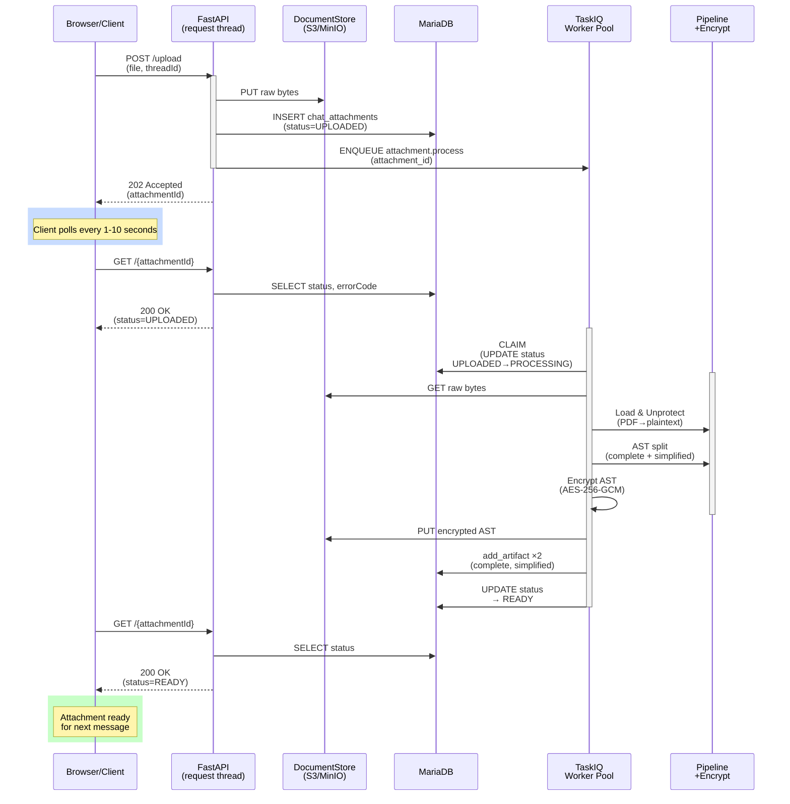

# chat_attachments — In-Conversation File Attachments

> Part of [docs/00_spec.md §3.4.9](../00_spec.md#349-post-chatagentattachmentsupload-get-chatagentattachments--in-conversation-file-attachments). Standard: [docs/00_rule.md](../00_rule.md).

---

## 1. Goal

A user attaches a file inside a `/chatagent/v3` conversation; the agent can
reference its content on the current turn and on every later turn, across all
three message-reconstruction paths (live POST, Redis reconnect, session
history).

## 2. MIME allow-list

Six formats are supported for chat attachments (`AttachmentMime` enum):

```
text/plain, text/markdown, text/html,
application/vnd.openxmlformats-officedocument.wordprocessingml.document,  (docx)
application/vnd.openxmlformats-officedocument.presentationml.presentation,  (pptx)
application/pdf
```

**Note:** `text/csv` is intentionally omitted from attachments (though supported by ingest). CSV requires tabular presentation (column headers, alignment) which plain-text AST representation doesn't preserve well for agent-readability. If CSV support is needed, consider uploading as a data-interchange format (e.g., import-it-as-context or store-it-in-a-table) in a future iteration. The `AttachmentMime` and `IngestMime` enums are schema-isolated so the two domains can evolve independently.

Extension fallback applies when the browser-supplied `Content-Type` is
generic/incorrect (`MIME_EXTENSIONS` mapping, shared util). Rejection →
`ATTACHMENT_MIME_UNSUPPORTED` (415) / `ATTACHMENT_TOO_LARGE` (413).

## 3. Unprotect whitelist

Not every MIME needs the external unprotect round-trip. Only binary formats
that can carry DRM/IRM wrapping go through it:

```python
UNPROTECT_MIMES = frozenset({
    AttachmentMime.PDF,
    AttachmentMime.DOCX,
    AttachmentMime.PPTX,
})
```

`text/plain` / `text/markdown` / `text/html` skip the call entirely — there is
no protection format for plain text, so calling the external API would be
pure waste. Skipped when `mime not in UNPROTECT_MIMES`, when no
`unprotect_client` is wired, or (fail-soft) when the call raises — original
bytes are used as a fallback in all three cases; the `chat_attachment`
pipeline never blocks on unprotect.

## 4. `chat_attachment` pipeline

`src/ragent/pipelines/chat_attachment/` — **load → optional unprotect → AST
build**. Reuses the existing `_MimeAwareSplitter` family
(`pipelines/ingest/splitter.py`) for the AST-building step; this pipeline
adds no new per-format parsing logic. Two AST variants are produced per
attachment:

- **complete** — full structural AST (same shape the ingest splitter already
  produces for the format).
- **simplified** — title + first two lines per section; **derived from the
  complete AST in memory** (a tree walk, not a second parse) — the document
  is parsed exactly once per attachment.

The pipeline's only responsibility is producing plaintext AST JSON. It does
**not** encrypt and does **not** persist — those are the caller's (service
layer's) responsibility (see §5, §6) per SRP: a unit test can assert the
pipeline's output without touching a key manager or MinIO.

## 5. AST encryption (KEK/DEK)

Both AST variants are encrypted before being written to storage.

**Key model** — one process-wide DEK, not per-artifact:

- `RAGENT_KEK_BASE64` — base64 KEK (32 bytes), injected at process start.
- `RAGENT_ENCRYPTED_DEK_BASE64` — the DEK, AES-Key-Wrapped under the KEK,
  generated offline, injected at process start.
- `KeyManager.from_env()` unwraps the DEK exactly once at startup
  (`security/key_manager.py`); the DEK lives in memory for the process
  lifetime. No per-artifact key generation, no `encrypted_dek` field stored
  alongside each artifact.
- **KEK rotation**: re-wrap the *same* DEK under the new KEK offline, update
  both env vars, restart. The DEK itself never changes, so no re-encryption
  of existing artifacts is needed.

**Cipher** — AES-256-GCM, one random 12-byte nonce per artifact
(`security/ast_cipher.py`). Storage envelope:

```json
{
  "version": "1.0",
  "algorithm": "AES-256-GCM",
  "nonce": "<hex>",
  "ciphertext": "<hex, GCM tag included>",
  "metadata": {
    "attachment_id": "att_xxx",
    "ast_type": "complete" | "simplified",
    "created_at": "2026-06-25T10:30:00Z"
  }
}
```

`ASTCipher` only depends on `KeyManager.dek` (Interface Segregation — it never
sees the KEK or the wrap/unwrap mechanics). `DocumentArtifactResolver`
decrypts on read, before the AST re-enters the chat context.

## 6. Storage

`storage/document_store.py::DocumentStore` — a narrow Protocol
(`put`/`get`/`delete`/`exists`) so the chat-attachment service depends on an
abstraction, not directly on MinIO (Dependency Inversion). `MinIODocumentStore`
is the only implementation today; built once in `bootstrap/composition.py`
and injected.

## 7. Async processing (worker mode, T-CAT.W2)

### User Story

**As a** user in a chat session  
**I want to** attach large files (PDF, DOCX, PPTX) without blocking the UI  
**So that** I can upload and immediately continue chatting, while the file processing happens in the background

**Scenario:** Alice attaches a 50MB PDF to a thread.
- **Upload (immediate):** Browser POSTs file → API accepts 202 → returns `attachmentId` within <100ms
- **Process (async):** Worker claims row, runs pipeline (parse PDF AST), encrypts, persists artifacts (~5-30s depending on file size)
- **Poll (client-driven):** Browser polls `GET /attachments/{id}` with exponential backoff (1s → 2s → 4s → cap 10s)
- **States:** `UPLOADED` (queued) → `PROCESSING` (running) → `READY` (done) or `FAILED` (error + details)
- **Result:** When status=READY, Alice can reference the attachment in her next message; agent fetches decrypted AST

### Processing Flow Diagram



### Implementation Details

`POST .../upload` is fast intake only: store raw bytes → `chat_attachments`
row (`UPLOADED`) → enqueue `attachment.process` via `TaskiqDispatcher` →
return `202` with `attachmentId`. The pipeline run (§4), unprotect
round-trip, AST build, and AES-GCM encryption (§5) all happen later, inside
the `ragent.worker` process — mirrors the existing `ingest` worker pattern
(`POST /ingest/v1` 202+id / `GET /ingest/v1/{id}` poll) so the API-server
request thread never blocks on PDF/DOCX/PPTX processing.

`workers/attachment.py`'s `attachment.process` task calls
`ChatAttachmentService.process(attachment_id)`, which:

1. Atomically claims the row (`UPLOADED → PROCESSING`, single transaction,
   conditional `UPDATE ... WHERE status='UPLOADED'`) — a `None` return means
   the row was already claimed, already terminal, or missing, and `process()`
   no-ops (logs and returns, no exception).
2. Re-fetches raw bytes from `DocumentStore` and runs the pipeline + encrypt
   + persist-artifacts steps that used to run inline in `upload()`.
3. Promotes to `READY` on success, or to `FAILED` with `error_code` /
   `error_reason` on any exception — caught and never re-raised, since
   nothing upstream of a TaskIQ task would handle it (no reconciler sweep in
   this scope; a crashed `PROCESSING` row stays `PROCESSING` until a future
   iteration adds one, same limitation `ingest` had before its reconciler
   existed).

Clients poll `GET /chatagent/v3/attachments/{attachmentId}` (mirrors
`GET /ingest/v1/{id}`) until `status` is `READY` or `FAILED`; `404` via
`ATTACHMENT_NOT_FOUND` problem-details for an unknown id. The existing
`GET /chatagent/v3/attachments` list endpoint returns the same
`errorCode`/`errorReason` fields for free (same `AttachmentInfo` model).

## 8. Persistence & reconstruction paths

Attachment metadata (filename, MIME, size, `attachment_id`) is rendered into
an `<attachments>` block inside the same `<hidden>` preamble `/chatagent/v3`
already uses for `<context>`/`<state>` (§3.4.7) — no new wrapper concept, no
`run_id` indirection (the block is bound to the user turn it's attached to,
the same way `<hidden>` already is):

```
<hidden>
<attachments>[{"attachmentId": "att_xxx", "filename": "report.pdf", "mimeType": "application/pdf", "sizeBytes": 12345}]</attachments>
<context>...</context>
</hidden>

{user message}
```

Two paths need attachment-specific code; a third needs none:

1. **Live POST** — `/chatagent/v3` resolves `attachment_ids` → builds the
   `<attachments>` block → folds it into the outbound `inputData.message`
   exactly like `<context>`/`<state>` already are. This happens before the
   producer thread starts, so it requires no new persistence of its own.
2. **Redis reconnect — no code change.** `ChatStreamStore` (§3.4.7) only
   tees the upstream's *response* SSE frames (`XADD` per frame); it never
   buffers the request. The `<attachments>` block lives solely in the
   outbound request built in path 1 above, and the response stream never
   echoes `<hidden>` content back (§3.4.7 "No `<hidden>` stripping on the
   stream"). So a reconnect — which only replays the already-buffered
   response frames via `XRANGE` — carries attachments correctly with zero
   attachment-aware code; the existing resumable-stream mechanism is
   already content-agnostic.
3. **Session history** — `services/chatagent_session.py` gains
   `_extract_attachments_from_hidden()`, which **must run before**
   `utility/hidden.py::strip_machine_context()` — that helper removes the
   entire `<hidden>…</hidden>` block (it doesn't single out `<attachments>`),
   so the extraction step has to read the block first; `strip_machine_context`
   then deletes the whole wrapper from the rendered text exactly as it does
   today for `<context>`/`<state>`.

No thread-ownership check is performed on attachment reads — identical to the
existing chat-session trust model; isolation comes from the `create_user`
column on `chat_attachments` plus the query predicate, not from an
authorization check.

## 9. Error codes

| Code | HTTP | Trigger |
|---|---|---|
| `ATTACHMENT_MIME_UNSUPPORTED` | 415 | MIME not in `AttachmentMime` allow-list (after extension fallback) |
| `ATTACHMENT_TOO_LARGE` | 413 | size exceeds cap |
| `ATTACHMENT_PARSE_FAILED` | 422 | `chat_attachment` pipeline raised during AST build |
| `ATTACHMENT_NOT_FOUND` | 404 | `GET /chatagent/v3/attachments/{id}` on unknown id (T-CAT.W2) |

## 10. DB schema (`014_chat_attachments_async.sql`, folds `013_chat_attachments.sql`)

`chat_attachments` (id, thread_id, create_user, filename, mime_type,
size_bytes, `status ENUM('UPLOADED','PROCESSING','READY','FAILED')`,
`error_code VARCHAR(64) NULL`, `error_reason VARCHAR(255) NULL`,
created_at) + `chat_attachment_artifacts` (attachment_id FK, ast_type,
storage_key, created_at). No `introduced_run_id` column — the `<hidden>`
block already binds the attachment to its turn. `error_code`/`error_reason`
mirror `documents.error_code`/`error_reason` (`006_documents_error_code.sql`)
— populated only when `process()` terminalizes to `FAILED` (§7).
