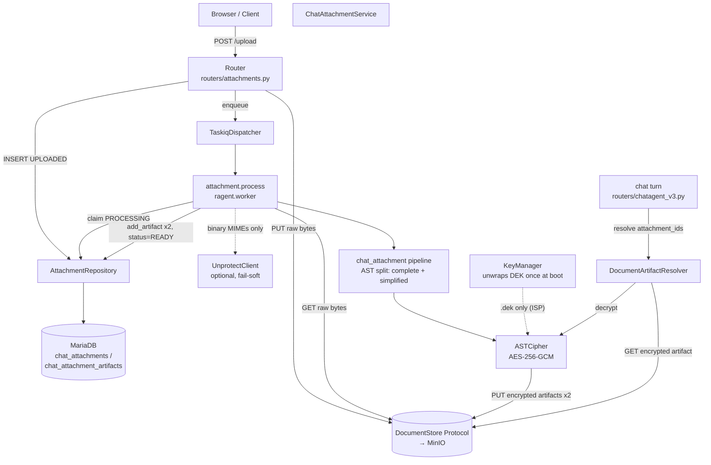
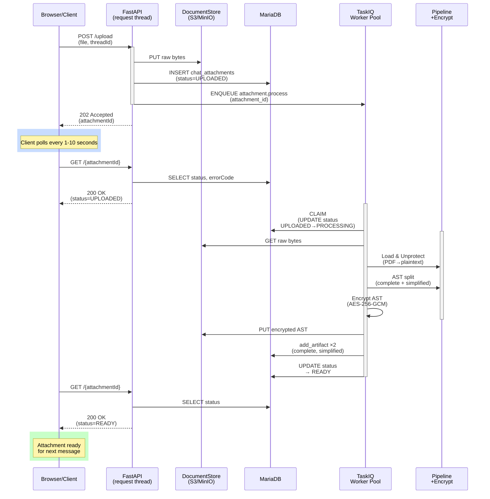
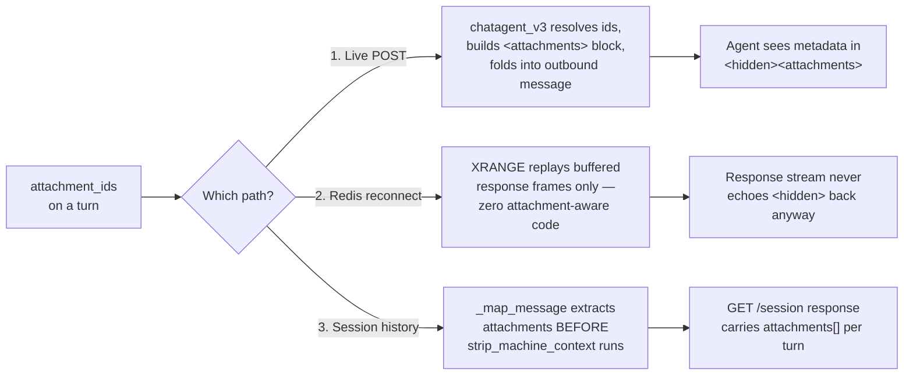
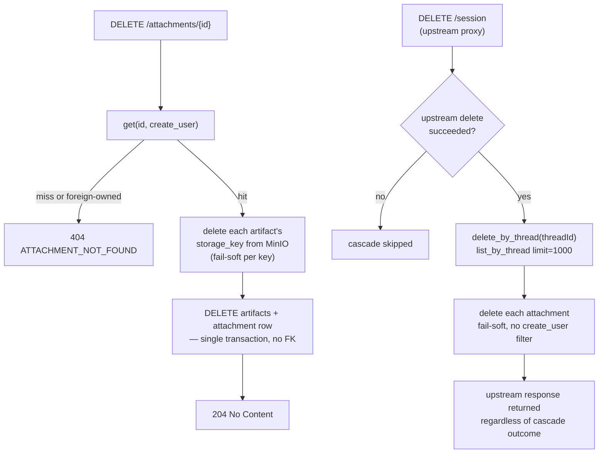

# chat_attachments — In-Conversation File Attachments

> Part of [docs/00_spec.md §3.4.9](../00_spec.md#349-post-chatagentattachmentsupload-get-chatagentattachments--in-conversation-file-attachments). Standard: [docs/00_rule.md](../00_rule.md).

---

## 1. Goal

A user attaches a file inside a `/chatagent/v3` conversation; the agent can
reference its content on the current turn and on every later turn, across all
three message-reconstruction paths (live POST, Redis reconnect, session
history).

### 1.1 Use Cases

**UC1 — Upload & background processing.**
As a user in a chat session, I want to attach large files (PDF, DOCX, PPTX)
without blocking the UI, so I can keep chatting while processing happens in
the background. Full user story, state machine, and sequence diagram: §7.

**UC2 — Reference an attachment across turns.**
As a user, once an attachment is `READY` I want the agent to see its content
on the current turn and on every later turn — including after a stream
reconnect or when reviewing session history — without re-uploading. The
`<attachments>` block is folded into every outbound live-POST request; a
dropped SSE connection resumes via Redis replay with zero attachment-aware
code; `GET /chatagent/v3/session` reconstructs the same `attachments` array
per turn from the stored `<hidden>` block (§8).

**UC3 — Browse & poll attachments.**
As a user, I want to see what I've attached to a thread, or across all my
threads, and check whether processing finished.
`GET /chatagent/v3/attachments?threadId=...` lists one thread's attachments;
`GET /chatagent/v3/attachments/mine` lists everything the caller has ever
uploaded, across threads (§11).

**UC4 — Delete an attachment, or a whole session.**
As a user, I want to remove an attachment I no longer need, or have all of a
session's attachments cleaned up automatically when I delete the session.
`DELETE /chatagent/v3/attachments/{id}` removes the raw file + both AST
artifacts + DB rows; `DELETE /chatagent/v3/session` cascades the same cleanup
to every attachment on that session once the upstream delete succeeds — no
separate call needed (§8.1).

### 1.2 Architecture

Component view — request-time vs. worker-time responsibilities:



Design principles already enforced by this layout:

- **DIP** — `ChatAttachmentService`/`DocumentArtifactResolver` depend on the
  `DocumentStore` Protocol, never on MinIO directly (§6).
- **SRP** — the pipeline (§4) only builds plaintext AST; encryption (§5) and
  persistence are the service's job.
- **OCP** — `ARTIFACT_CONTENT_TYPE` (§2) is a lookup table; a new format adds
  an entry, never a branch.
- **ISP** — `ASTCipher` depends only on `KeyManager.dek` (§5), never the KEK
  or the wrap/unwrap mechanics.

## 2. MIME allow-list

Six formats are supported for chat attachments (`AttachmentMime` enum):

```
text/plain, text/markdown, text/html,
application/vnd.openxmlformats-officedocument.wordprocessingml.document,  (docx)
application/vnd.openxmlformats-officedocument.presentationml.presentation,  (pptx)
application/pdf
```

**Note:** `text/csv` is intentionally omitted from attachments (though supported by ingest). CSV requires tabular presentation (column headers, alignment) which plain-text AST representation doesn't preserve well for agent-readability. If CSV support is needed, consider uploading as a data-interchange format (e.g., import-it-as-context or store-it-in-a-table) in a future iteration. The `AttachmentMime` and `IngestMime` enums are schema-isolated so the two domains can evolve independently.

Extension fallback applies when the browser-supplied `Content-Type` is
generic/incorrect (`MIME_EXTENSIONS` mapping, shared util). Rejection →
`ATTACHMENT_MIME_UNSUPPORTED` (415) / `ATTACHMENT_TOO_LARGE` (413).

`ARTIFACT_CONTENT_TYPE: dict[AttachmentMime, str]` (`schemas/attachments.py`)
pins which content_type an attachment's rendered AST artifact gets persisted
under (`chat_attachment_artifacts.content_type`, §10) — a lookup table, not
branching logic in the service, so adding a format only adds an entry (OCP).
Every format currently maps to `text/markdown` since the pipeline (§4) only
ever renders markdown.

## 3. Unprotect whitelist

Not every MIME needs the external unprotect round-trip. Only binary formats
that can carry DRM/IRM wrapping go through it:

```python
UNPROTECT_MIMES = frozenset({
    AttachmentMime.PDF,
    AttachmentMime.DOCX,
    AttachmentMime.PPTX,
})
```

`text/plain` / `text/markdown` / `text/html` skip the call entirely — there is
no protection format for plain text, so calling the external API would be
pure waste. Skipped when `mime not in UNPROTECT_MIMES`, when no
`unprotect_client` is wired, or (fail-soft) when the call raises — original
bytes are used as a fallback in all three cases; the `chat_attachment`
pipeline never blocks on unprotect.

## 4. `chat_attachment` pipeline

`src/ragent/pipelines/chat_attachment/` — **load → optional unprotect → AST
build**. Reuses the existing `_MimeAwareSplitter` family
(`pipelines/ingest/splitter.py`) for the AST-building step; this pipeline
adds no new per-format parsing logic. Two AST variants are produced per
attachment:

- **complete** — full structural AST (same shape the ingest splitter already
  produces for the format).
- **simplified** — every section's heading title in full, plus the first 50
  characters of its body text; **derived from the complete AST in memory**
  (a tree walk, not a second parse) — the document is parsed exactly once
  per attachment. This applies uniformly across PDF, DOCX, PPTX, and
  Markdown (and, as a consequence of the single generic algorithm, HTML and
  plain text too — the latter two simply have no heading atoms, so they
  collapse to one section). Sections are delimited by heading atoms, so
  every heading in the document gets its own simplified section — none are
  dropped.

The pipeline's only responsibility is producing plaintext AST JSON. It does
**not** encrypt and does **not** persist — those are the caller's (service
layer's) responsibility (see §5, §6) per SRP: a unit test can assert the
pipeline's output without touching a key manager or MinIO.

Content for `BINARY_MIMES` (DOCX/PPTX/PDF) is passed to the AST splitter as
raw bytes (`meta["raw_bytes"]`), never decoded as UTF-8 text — those formats
are binary containers, and decoding them as text would raise before the
splitter ever runs. Text formats (`text/plain`, `text/markdown`, `text/html`)
are decoded to `str` as before.

Heading detection is format-agnostic: every splitter that produces a heading
atom marks it by prefixing `meta["raw_content"]` with markdown `#`s (1-6 of
them). Markdown/PDF atoms get this naturally from the rendered markdown;
HTML atoms carry their own `<h1>`-`<h6>` tag instead (detected separately).
DOCX paragraphs styled "Heading N" (or "Title", treated as level 1) and a
PPTX slide's title placeholder are mapped to the same `#`-prefixed
`raw_content` convention, so `_build_simplified`'s single tree-walk treats
them identically to a markdown heading — no per-format simplification logic
is needed.

## 5. AST encryption (KEK/DEK)

Both AST variants are encrypted before being written to storage.

**Key model** — one process-wide DEK, not per-artifact:

- `RAGENT_KEK_BASE64` — base64 KEK (32 bytes), injected at process start.
- `RAGENT_ENCRYPTED_DEK_BASE64` — the DEK, AES-Key-Wrapped under the KEK,
  generated offline, injected at process start.
- The composition root reads both env vars and constructs `KeyManager`,
  which unwraps the DEK exactly once at startup (`security/key_manager.py`);
  the DEK lives in memory for the process lifetime. No per-artifact key
  generation, no `encrypted_dek` field stored alongside each artifact.
- **Generation/rotation** — `scripts/gen_attachment_keys.py` (offline CLI,
  never an HTTP endpoint — secret material must never enter a request/response
  body or be observable to a proxy/log/APM):
  ```bash
  # first-time bootstrap — mints a brand-new KEK + DEK pair
  uv run python scripts/gen_attachment_keys.py generate

  # KEK rotation — re-wraps the SAME DEK under a freshly generated KEK;
  # the DEK itself never changes, so existing artifacts need no re-encryption
  uv run python scripts/gen_attachment_keys.py rotate \
    --old-kek "$RAGENT_KEK_BASE64" \
    --old-encrypted-dek "$RAGENT_ENCRYPTED_DEK_BASE64"
  ```
  Both subcommands print `RAGENT_KEK_BASE64=...` / `RAGENT_ENCRYPTED_DEK_BASE64=...`
  lines to stdout only. Paste them into `.env` or a secret manager directly;
  update both env vars together and restart — partial rotation (only one var
  updated) breaks `KeyManager` construction on next boot.
- **Manual decrypt** — `scripts/decrypt_artifact.py` (offline CLI) reads a
  storage envelope (file path, or stdin via `-`) and prints the decrypted
  plaintext markdown to stdout, for incident response / support cases where
  an artifact's content must be inspected outside the running app:
  ```bash
  uv run python scripts/decrypt_artifact.py path/to/envelope.json
  cat envelope.json | uv run python scripts/decrypt_artifact.py -
  ```
  Requires `RAGENT_KEK_BASE64` and `RAGENT_ENCRYPTED_DEK_BASE64` set to the
  same pair the artifact was encrypted under. Reuses `KeyManager`/`ASTCipher`
  directly — no separate decrypt path.

**Cipher** — AES-256-GCM, one random 12-byte nonce per artifact
(`security/ast_cipher.py`). Storage envelope:

```json
{
  "version": "1.0",
  "algorithm": "AES-256-GCM",
  "nonce": "<hex>",
  "ciphertext": "<hex, GCM tag included>"
}
```

`ASTCipher` only depends on `KeyManager.dek` (Interface Segregation — it never
sees the KEK or the wrap/unwrap mechanics). `DocumentArtifactResolver`
decrypts on read, before the AST re-enters the chat context.

## 6. Storage

`storage/document_store.py::DocumentStore` — a narrow Protocol
(`put`/`get`/`delete`/`exists`) so the chat-attachment service depends on an
abstraction, not directly on MinIO (Dependency Inversion). `MinIODocumentStore`
is the only implementation today; built once in `bootstrap/composition.py`
and injected.

## 7. Async processing (worker mode, T-CAT.W2)

### User Story

**As a** user in a chat session  
**I want to** attach large files (PDF, DOCX, PPTX) without blocking the UI  
**So that** I can upload and immediately continue chatting, while the file processing happens in the background

**Scenario:** Alice attaches a 50MB PDF to a thread.
- **Upload (immediate):** Browser POSTs file → API accepts 202 → returns `attachmentId` within <100ms
- **Process (async):** Worker claims row, runs pipeline (parse PDF AST), encrypts, persists artifacts (~5-30s depending on file size)
- **Poll (client-driven):** Browser polls `GET /attachments/{id}` with exponential backoff (1s → 2s → 4s → cap 10s)
- **States:** `UPLOADED` (queued) → `PROCESSING` (running) → `READY` (done) or `FAILED` (error + details)
- **Result:** When status=READY, Alice can reference the attachment in her next message; agent fetches decrypted AST

### Processing Flow Diagram



### Implementation Details

`POST .../upload` is fast intake only: store raw bytes → `chat_attachments`
row (`UPLOADED`) → enqueue `attachment.process` via `TaskiqDispatcher` →
return `202` with `attachmentId`. The pipeline run (§4), unprotect
round-trip, AST build, and AES-GCM encryption (§5) all happen later, inside
the `ragent.worker` process — mirrors the existing `ingest` worker pattern
(`POST /ingest/v1` 202+id / `GET /ingest/v1/{id}` poll) so the API-server
request thread never blocks on PDF/DOCX/PPTX processing.

`workers/attachment.py`'s `attachment.process` task calls
`ChatAttachmentService.process(attachment_id)`, which:

1. Atomically claims the row (`UPLOADED → PROCESSING`, single transaction,
   conditional `UPDATE ... WHERE status='UPLOADED'`) — a `None` return means
   the row was already claimed, already terminal, or missing, and `process()`
   no-ops (logs and returns, no exception).
2. Re-fetches raw bytes from `DocumentStore` and runs the pipeline + encrypt
   + persist-artifacts steps that used to run inline in `upload()`.
3. Promotes to `READY` on success, or to `FAILED` with `error_code` /
   `error_reason` on any exception — caught and never re-raised, since
   nothing upstream of a TaskIQ task would handle it (no reconciler sweep in
   this scope; a crashed `PROCESSING` row stays `PROCESSING` until a future
   iteration adds one, same limitation `ingest` had before its reconciler
   existed).

If the task is picked up by a worker process where `RAGENT_KEK_BASE64` is
unset (`container.chat_attachment_service is None`), `attachment_process_task`
marks the row `FAILED` with `error_code=ATTACHMENT_FEATURE_DISABLED` directly
via `container.attachment_repository` (built unconditionally — it only
depends on `engine` — unlike the rest of the attachment stack, which stays
gated on the KEK) instead of acking silently; otherwise the row would stay
`UPLOADED` forever with no client-visible signal.

Clients poll `GET /chatagent/v3/attachments/{attachmentId}` (mirrors
`GET /ingest/v1/{id}`) until `status` is `READY` or `FAILED`; `404` via
`ATTACHMENT_NOT_FOUND` problem-details for an unknown id. The existing
`GET /chatagent/v3/attachments` list endpoint returns the same
`errorCode`/`errorReason` fields for free (same `AttachmentInfo` model).

## 8. Persistence & reconstruction paths

Attachment metadata (filename, MIME, size, `attachment_id`) is rendered into
an `<attachments>` block inside the same `<hidden>` preamble `/chatagent/v3`
already uses for `<context>`/`<state>` (§3.4.7) — no new wrapper concept, no
`run_id` indirection (the block is bound to the user turn it's attached to,
the same way `<hidden>` already is):

```
<hidden>
<attachments>[{"attachmentId": "01J9ABCDEFGHJKMNPQRSTVWXYZ", "filename": "report.pdf", "mimeType": "application/pdf", "sizeBytes": 12345, "variant": "complete", "content": "# Report\n..."}]</attachments>
<context>...</context>
</hidden>

{user message}
```

### 8.0 `<attachments>` element field reference

Each element of the `<attachments>` array is assembled once per
`attachment_id`, per turn, by `DocumentArtifactResolver.resolve()`
(`src/ragent/services/document_artifact_resolver.py`). It is **not** a
persisted schema/Pydantic model — it's a plain `dict[str, Any]` built
field-by-field, then `json.dumps()`'d into the string that
`adk_caller.py::_context_preamble()` wraps in `<attachments>...</attachments>`.

| Field | Always present? | Source file / class | Notes |
|---|---|---|---|
| `attachmentId` | yes | `DocumentArtifactResolver.resolve()`, from `AttachmentRow.attachment_id` (`repositories/attachment_repository.py`) | ULID, matches `chat_attachments.attachment_id` |
| `filename` | yes | same — `AttachmentRow.filename` | original upload filename |
| `mimeType` | yes | same — `AttachmentRow.mime_type` | one of `AttachmentMime` (`schemas/attachments.py`) |
| `sizeBytes` | yes | same — `AttachmentRow.size_bytes` | raw file size at upload time |
| `variant` | only when the attachment has at least one `READY` artifact | `DocumentArtifactResolver.resolve()`, set from the selected `ArtifactRow.variant` (`repositories/attachment_repository.py`) | `"complete"` or `"simplified"` — records *which* AST variant was picked by the `char_count` budget check (§4), independent of whether decryption then succeeds |
| `content` | only when `variant` is set **and** decrypt succeeds | `DocumentArtifactResolver.resolve()`, via `ASTCipher.decrypt_ast()` (`security/ast_cipher.py`) | decrypted plaintext markdown content; omitted (logged as `document_artifact_resolver.decrypt_failed`) on `ValueError`/`KeyError`/`json.JSONDecodeError`/`ASTDecryptionError`. May also be **shorter than `char_count` implies, or entirely absent**, when the per-attachment cap (`ATTACHMENT_ARTIFACT_MAX_CHARS`) or the per-turn aggregate cap (`ATTACHMENT_TOTAL_MAX_CHARS`) trims it — see §12; a truncation logs `document_artifact_resolver.attachment_content_truncated` |

`attachment_id` values themselves originate from `body.attachmentIds` on the
live-POST request (`RunAgentInput.attachment_ids`,
`packages/twp-ai/src/twp_ai/schemas.py`), read by
`routers/chatagent_v3.py` and passed straight into
`DocumentArtifactResolver.resolve()` (line ~181) — the router never builds
the JSON itself.

### Reconstruction Flow Diagram



Two paths need attachment-specific code; a third needs none:

1. **Live POST** — `/chatagent/v3` resolves `attachment_ids` → builds the
   `<attachments>` block → folds it into the outbound `inputData.message`
   exactly like `<context>`/`<state>` already are. This happens before the
   producer thread starts, so it requires no new persistence of its own.
2. **Redis reconnect — no code change.** `ChatStreamStore` (§3.4.7) only
   tees the upstream's *response* SSE frames (`XADD` per frame); it never
   buffers the request. The `<attachments>` block lives solely in the
   outbound request built in path 1 above, and the response stream never
   echoes `<hidden>` content back (§3.4.7 "No `<hidden>` stripping on the
   stream"). So a reconnect — which only replays the already-buffered
   response frames via `XRANGE` — carries attachments correctly with zero
   attachment-aware code; the existing resumable-stream mechanism is
   already content-agnostic.
3. **Session history** — `services/chatagent_session.py::_map_message()` calls
   `_extract_attachments_from_hidden()` **before**
   `utility/hidden.py::strip_machine_context()` — that helper removes the
   entire `<hidden>…</hidden>` block (it doesn't single out `<attachments>`),
   so the extraction step has to read the block first; `strip_machine_context`
   then deletes the whole wrapper from the rendered text exactly as it does
   today for `<context>`/`<state>`. `_map_message()` decodes the `<hidden>`
   block once and reuses it for both steps, so `GET /chatagent/v3/session`
   responses carry each user turn's `attachments` array (T-CAT.W11).

`GET /chatagent/v3/attachments` and `GET /chatagent/v3/attachments/{attachmentId}`
scope reads to the requesting user: `AttachmentRepository.get()` and
`list_by_thread()` both take an optional `create_user` filter that the router
passes through as `AND create_user = :create_user` in the SQL `WHERE` clause
(defaulting to `"anonymous"`, matching the upload endpoint's existing
unauthenticated-caller convention). A row owned by a different user is
indistinguishable from a missing row — both yield `None`/empty and the
existing 404/empty-list response — so no separate authorization branch is
needed in the router.

### 8.1 Deletion & cross-thread listing (T-CAT.W11)

### Deletion Flow Diagram



- **`DELETE /chatagent/v3/attachments/{attachmentId}`** — `ChatAttachmentService.delete()`
  first calls `AttachmentRepository.get(attachment_id, create_user=user_id)`;
  a missing or foreign-owned row returns `404 ATTACHMENT_NOT_FOUND` (same
  ownership-via-`create_user` scoping as the GET endpoints — a foreign-owned
  row is indistinguishable from a missing one). On a match, every artifact's
  `storage_key` is deleted from MinIO **fail-soft per key** (a storage error
  is logged and does not block the DB delete), then
  `AttachmentRepository.delete()` removes both `chat_attachment_artifacts`
  rows and the `chat_attachments` row in one transaction (two `DELETE`
  statements — no physical FK, per `docs/00_rule.md`). Success returns `204`
  with no body.
- **`GET /chatagent/v3/attachments/mine`** — `AttachmentRepository.list_by_user()`
  lists every attachment the requesting user has uploaded, across all
  threads (unlike `GET /chatagent/v3/attachments`, which is thread-scoped).
  Registered before `GET /chatagent/v3/attachments/{attachmentId}` in the
  router so the literal `mine` path segment isn't swallowed by the
  path-param route.
- **Session-delete cascade** — `DELETE /chatagent/v3/session` (the existing
  upstream session-delete proxy) now also calls
  `ChatAttachmentService.delete_by_thread(session)` once the upstream delete
  succeeds (`response.status_code < 400`). `delete_by_thread()` lists every
  attachment for the thread (single page, `limit=1000` — no cursor
  pagination, no precedent elsewhere for paginated cascade deletes) and
  deletes each one the same fail-soft way as the single-attachment path,
  with no `create_user` filter (the whole session is going away). A failed
  upstream delete skips the cascade entirely; a cascade failure (storage or
  DB) is caught, logged, and never masks the already-built upstream
  response — the proxy's status code is what the caller sees either way.

## 9. Error codes

| Code | HTTP | Trigger |
|---|---|---|
| `ATTACHMENT_MIME_UNSUPPORTED` | 415 | MIME not in `AttachmentMime` allow-list (after extension fallback) |
| `ATTACHMENT_TOO_LARGE` | 413 | size exceeds cap |
| `ATTACHMENT_PARSE_FAILED` | 422 | `chat_attachment` pipeline raised during AST build |
| `ATTACHMENT_NOT_FOUND` | 404 | `GET`/`DELETE /chatagent/v3/attachments/{id}` on unknown or foreign-owned id (T-CAT.W2, T-CAT.W11) |
| `ATTACHMENT_TOO_MANY_FILES` | 413 — surfaced as `RUN_ERROR` over a 200 SSE stream, never a literal HTTP 413 (v3 contract) | `POST /chatagent/v3` `body.attachmentIds` exceeds `ATTACHMENT_MAX_FILES` (T-CAT.W16) |
| `ATTACHMENT_FEATURE_DISABLED` | n/a — `TaskErrorCode`, persisted to `chat_attachments.error_code` | worker picked up `attachment.process` on a process with `RAGENT_KEK_BASE64` unset (§7) |

## 10. DB schema (`014_chat_attachments.sql`)

No `introduced_run_id` column — the `<hidden>` block already binds the
attachment to its turn. `error_code`/`error_reason` mirror
`documents.error_code`/`error_reason` (`006_documents_error_code.sql`) —
populated only when `process()` terminalizes to `FAILED` (§7).
`chat_attachment_artifacts.attachment_id` is an application-level
relationship only — no physical FK, per `docs/00_rule.md` "No Physical
Foreign Keys"; `uq_attachment_variant`'s leftmost prefix already covers
attachment_id lookups. `content_type` records the rendered MIME of an
artifact's plaintext content (currently always `text/markdown` — see
`ARTIFACT_CONTENT_TYPE` in §2) as a real, queryable DB column, set once at
artifact-creation time. It is **not** duplicated inside the encrypted
envelope (§5) — `ASTCipher.decrypt_ast()` never reads envelope metadata
back, so storing it there would be write-only. `char_count` is
`len()` of the rendered plaintext markdown for that variant, computed once
at artifact-creation time before encryption (free — the string is already
in memory) and used by `DocumentArtifactResolver` to gate `complete` vs
`simplified` selection against `ATTACHMENT_ARTIFACT_MAX_CHARS` (T-CAT.W16)
without decrypting first.

Authoritative DDL (`migrations/014_chat_attachments.sql`, folded into
`migrations/schema.sql`):

```sql
CREATE TABLE IF NOT EXISTS chat_attachments (
  id            BIGINT UNSIGNED NOT NULL AUTO_INCREMENT,
  attachment_id CHAR(26)     NOT NULL,
  thread_id     VARCHAR(64)  NOT NULL,
  create_user   VARCHAR(64)  NOT NULL,
  filename      VARCHAR(256) NOT NULL,
  mime_type     VARCHAR(128) NOT NULL,
  size_bytes    BIGINT UNSIGNED NOT NULL,
  status        ENUM('UPLOADED','PROCESSING','READY','FAILED') NOT NULL DEFAULT 'UPLOADED',
  created_at    DATETIME(6)  NOT NULL,
  updated_at    DATETIME(6)  NOT NULL,
  error_code    VARCHAR(64)  NULL,
  error_reason  VARCHAR(255) NULL,
  PRIMARY KEY (id),
  UNIQUE KEY uq_attachment_id (attachment_id),
  INDEX idx_thread_created (thread_id, created_at),
  INDEX idx_create_user_attachment (create_user, attachment_id)
) ENGINE=InnoDB DEFAULT CHARSET=utf8mb4;

CREATE TABLE IF NOT EXISTS chat_attachment_artifacts (
  id            BIGINT UNSIGNED NOT NULL AUTO_INCREMENT,
  attachment_id CHAR(26)     NOT NULL,
  variant       ENUM('complete','simplified') NOT NULL,
  storage_key   VARCHAR(256) NOT NULL,
  content_type  VARCHAR(64)  NOT NULL DEFAULT 'text/markdown',
  char_count    INT UNSIGNED NOT NULL DEFAULT 0,
  created_at    DATETIME(6)  NOT NULL,
  PRIMARY KEY (id),
  UNIQUE KEY uq_attachment_variant (attachment_id, variant)
) ENGINE=InnoDB DEFAULT CHARSET=utf8mb4;
```

## 11. API Reference

All endpoints below are nested under `/chatagent/v3/attachments` and are
registered **only** when both `RAGENT_KEK_BASE64` and
`RAGENT_ENCRYPTED_DEK_BASE64` are set (§5, §12). Full curl examples live in
[`docs/API.md`](../API.md#attachments-chatagentv3attachments); this table is
the authoritative shape reference.

| Method & path | Purpose | Success | Key errors |
|---|---|---|---|
| `POST /upload` | Fast intake: store raw bytes, `INSERT ... UPLOADED`, enqueue `attachment.process` (§7) | `202 {attachmentId}` | `415 ATTACHMENT_MIME_UNSUPPORTED`, `413 ATTACHMENT_TOO_LARGE` |
| `GET /{attachmentId}` | Poll processing status | `200` `AttachmentInfo` | `404 ATTACHMENT_NOT_FOUND` |
| `GET ?threadId=...` | List one thread's attachments, caller-scoped | `200 {attachments: AttachmentInfo[]}` | — |
| `GET /mine` | List every attachment the caller has uploaded, across threads | `200 {attachments: AttachmentInfo[]}` | — |
| `DELETE /{attachmentId}` | Delete raw file + both artifacts + DB rows (§8.1) | `204 No Content` | `404 ATTACHMENT_NOT_FOUND` |

`AttachmentInfo` shape (shared by the poll endpoint and both list endpoints):

```json
{
  "attachmentId": "01J9ABCDEFGHJKMNPQRSTVWXYZ",
  "filename": "Q3_OKRs.pdf",
  "mimeType": "application/pdf",
  "sizeBytes": 125432,
  "status": "READY",
  "errorCode": null,
  "errorReason": null
}
```

`status` is one of `UPLOADED` / `PROCESSING` / `READY` / `FAILED`;
`errorCode`/`errorReason` are populated only when `status="FAILED"`. Every
read/write is scoped by `create_user` (resolved from `X-User-Id`, default
`"anonymous"`) — a foreign-owned or unknown `attachmentId` is
indistinguishable: both yield `404 ATTACHMENT_NOT_FOUND` (or an empty list)
(§8).

## 12. Environment Variables

| Variable | Default | Notes |
|---|---|---|
| `RAGENT_KEK_BASE64` | *(unset → feature disabled)* | Base64 KEK (32 bytes). Set together with the var below to register the attachment routes and construct `KeyManager`/`ASTCipher` (§5). Documented in `docs/spec/env_vars.md` §4.6.4. |
| `RAGENT_ENCRYPTED_DEK_BASE64` | *(required when `RAGENT_KEK_BASE64` set)* | Base64 DEK, AES-Key-Wrapped under the KEK; unwrapped once at boot (§5). Documented in `docs/spec/env_vars.md` §4.6.4. |
| `ATTACHMENT_MAX_SIZE_BYTES` | `52428800` (50 MB) | Upload size cap — `ChatAttachmentService.upload()` raises `FileTooLarge` over this, surfaced as `413 ATTACHMENT_TOO_LARGE`. Read via `_int_env()` in `composition.py` (DIP — no other module reads this var). Documented in `docs/spec/env_vars.md` §4.6.6. |
| `ATTACHMENT_ARTIFACT_MAX_CHARS` | `10000` | Context-window budget — `DocumentArtifactResolver` selects the `complete` artifact only when its `char_count` is at or under this; otherwise falls back to `simplified` (§10, T-CAT.W16). Also enforced as a hard per-attachment truncation cap on whichever variant (`complete` or `simplified`) is selected — content past this length is cut and marked with a `…[truncated]` suffix. Read via `_int_env()` in `composition.py`. Documented in `docs/spec/env_vars.md` §4.6.6. |
| `ATTACHMENT_TOTAL_MAX_CHARS` | `50000` | Per-turn aggregate budget across **all** resolved attachments — `DocumentArtifactResolver` tracks running chars used (in `attachmentIds` order) and truncates/omits `content` once the budget is spent, bounding worst case from `ATTACHMENT_MAX_FILES × ATTACHMENT_ARTIFACT_MAX_CHARS` down to this ceiling. A truncation logs `document_artifact_resolver.attachment_content_truncated`. Read via `_int_env()` in `composition.py`. |
| `ATTACHMENT_MAX_FILES` | `10` | Cap on `body.attachmentIds` length per `POST /chatagent/v3` turn — over this is a `RUN_ERROR ATTACHMENT_TOO_MANY_FILES` (§9, T-CAT.W16). Read via `_int_env()` in `composition.py`. Documented in `docs/spec/env_vars.md` §4.6.6. |

Full inventory of every other timeout/threshold the process reads:
[`docs/spec/env_vars.md`](env_vars.md).

## 13. End-to-end curl walkthrough

Full request/response shapes for every endpoint below live in
[`docs/API.md`](../API.md#attachments-chatagentv3attachments); this section
chains them into one bootstrap → upload → chat → inspect flow.

### 13.1 Bootstrap the KEK/DEK pair (one-time, offline)

The attachment routes (§11) only register when both env vars below are set.
Mint a pair with `scripts/gen_attachment_keys.py` (never an HTTP endpoint —
secret material must never enter a request/response body, §5):

```bash
uv run python scripts/gen_attachment_keys.py generate
# RAGENT_KEK_BASE64=...
# RAGENT_ENCRYPTED_DEK_BASE64=...
```

Paste both lines into `.env` (or your secret manager) and restart the API +
worker processes — `KeyManager` unwraps the DEK once at boot
(`security/key_manager.py`).

### 13.2 Upload a file

```bash
curl -X POST "http://localhost:8000/chatagent/v3/attachments/upload" \
  -H "X-User-Id: alice" \
  -F "file=@report.pdf" \
  -F "threadId=thread_1"
# 202 {"attachmentId": "01J9ABCDEFGHJKMNPQRSTVWXYZ"}
```

### 13.3 Poll until `READY`

```bash
curl "http://localhost:8000/chatagent/v3/attachments/01J9ABCDEFGHJKMNPQRSTVWXYZ" \
  -H "X-User-Id: alice"
# 200 {"attachmentId": "...", "status": "UPLOADED" | "PROCESSING" | "READY" | "FAILED", ...}
```

Repeat with backoff (1s → 2s → 4s → cap 10s, §7) until `status` is `READY`
(pipeline + AES-256-GCM encryption finished) or `FAILED` (`errorCode`/
`errorReason` populated).

### 13.4 Reference it in a chat turn

Pass the `attachmentId` from 13.2 in `attachmentIds` on the next
`/chatagent/v3` POST (`RunAgentInput.attachment_ids`,
`packages/twp-ai/src/twp_ai/schemas.py`); the router resolves it via
`DocumentArtifactResolver` into the `<attachments>` block (§8) before the
turn reaches the upstream agent:

```bash
curl -X POST http://localhost:8000/chatagent/v3 \
  -H "X-Auth-Token: <jwt>" -H "Content-Type: application/json" \
  -d '{"threadId":"thread_1","runId":"run_1","messages":[{"id":"m1","role":"user","content":"Summarise the attached report."}],"tools":[],"state":null,"context":[],"forwardedProps":null,"attachmentIds":["01J9ABCDEFGHJKMNPQRSTVWXYZ"]}' \
  --no-buffer
```

### 13.5 Manually inspect an encrypted artifact (incident response)

Every artifact is stored as an AES-256-GCM envelope
(`{"version", "algorithm", "nonce", "ciphertext"}`, §5) at
`chat_attachment_artifacts.storage_key`. To read one outside the running
app, fetch the object from MinIO/S3 and decrypt it offline with
`scripts/decrypt_artifact.py` (requires the same `RAGENT_KEK_BASE64` /
`RAGENT_ENCRYPTED_DEK_BASE64` pair from 13.1):

```bash
uv run python scripts/decrypt_artifact.py path/to/envelope.json
# or, piped from wherever the envelope bytes came from:
cat envelope.json | uv run python scripts/decrypt_artifact.py -
# prints the decrypted plaintext markdown AST to stdout
```

If the pair is rotated later, use the same script's sibling subcommand on
`gen_attachment_keys.py` — `rotate` re-wraps the existing DEK under a fresh
KEK without touching already-stored artifacts (§5):

```bash
uv run python scripts/gen_attachment_keys.py rotate \
  --old-kek "$RAGENT_KEK_BASE64" \
  --old-encrypted-dek "$RAGENT_ENCRYPTED_DEK_BASE64"
```
