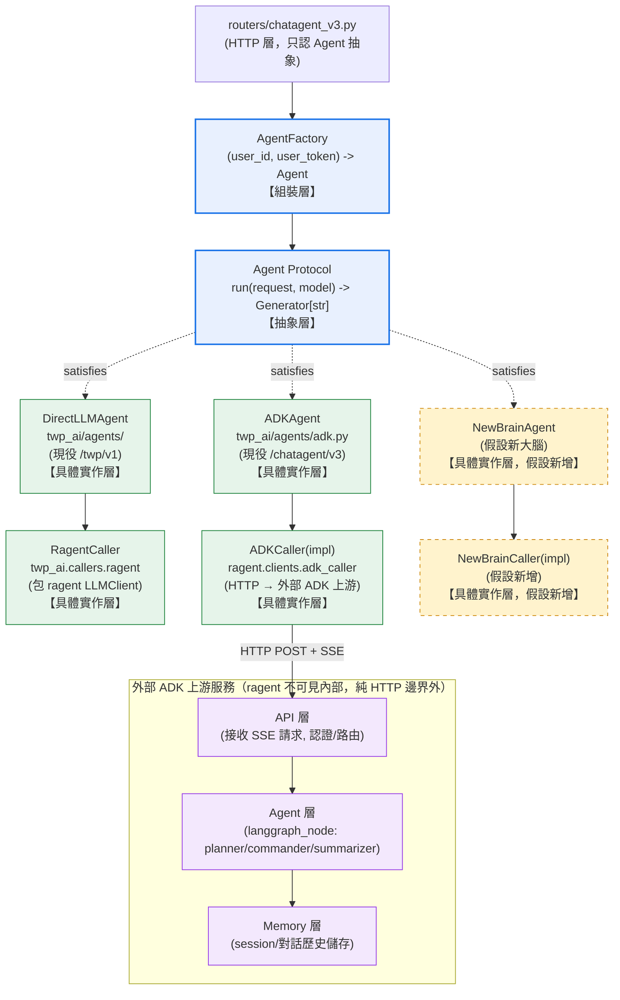

# Chatagent Agent Backend — DIP/OCP abstraction & brain-swap runbook

> Authored: 2026-06-23  
> Maintained by: Dev  
> Source modules: `src/ragent/routers/chatagent_v3.py`, `src/ragent/bootstrap/composition.py`,
> `src/ragent/clients/adk_caller.py`, `src/ragent/services/chatagent_session.py`,
> `packages/twp-ai/src/twp_ai/agent.py`, `packages/twp-ai/src/twp_ai/agents/`

This document records why `/chatagent/v3` is structured the way it is, and how
to swap the upstream "agent brain" for a different implementation (library-based
or API-based) without touching router code.

---

## Table of Contents

1. [Motivation & SOLID rationale](#1-motivation--solid-rationale)
2. [The `Agent` Protocol](#2-the-agent-protocol)
3. [Current implementations](#3-current-implementations)
4. [Call chain](#4-call-chain)
   - [4.1 Module dependency wireframe (mermaid)](#41-module-dependency-wireframe-mermaid)
   - [4.2 Runtime call chain](#42-runtime-call-chain)
5. [Brain-swap runbook](#5-brain-swap-runbook)
   - [5.1 New Agent 上車步驟（精簡版）](#51-new-agent-上車步驟精簡版)
   - [5.2 New Agent 上車步驟（完整版）](#52-new-agent-上車步驟完整版)
6. [Zero-modification / two-touch-files checklist](#6-zero-modification--two-touch-files-checklist)
7. [Known limitation: session history is not portable](#7-known-limitation-session-history-is-not-portable)

---

## 1. Motivation & SOLID rationale

`/chatagent/v3` proxies a chat run to an external "ADK"-style upstream agent
service. Before this refactor, the router (`routers/chatagent_v3.py`) directly
imported and inline-constructed `ADKAgent`/`ADKCaller` — a high-level module
(the router, which owns HTTP contract / rate-limit / resumable-stream policy)
depending on low-level concrete implementations. That is the dependency
direction DIP forbids, and it meant swapping the upstream brain required
editing the router itself (an OCP violation).

The fix did not require inventing new abstractions: `packages/twp-ai` already
ships a generic `Agent` Protocol and uses it correctly at `/twp/v1`
(`DirectLLMAgent(RagentCaller(...))` injected into `twp_ai.app.create_router`).
`/chatagent/v3` needed the same pattern, adapted for one constraint: the ADK
caller carries per-request state (`user_id`, `user_token`), so it cannot be a
singleton `Agent` instance like `/twp/v1`'s. The router now receives an
**`AgentFactory`** — a `(user_id, user_token) -> Agent` callable — built once
in the composition root and called per request.

| Principle | How it's satisfied |
|---|---|
| **S** | Router: HTTP contract / rate-limit / resumable-stream. Composition root: backend selection & wiring. Caller: wire-format translation. Each has one reason to change. |
| **O** | A new backend = a new `Agent` implementation + a new `_build_xxx_agent_factory()` branch in `composition.py`. Zero edits to `routers/chatagent_v3.py`. |
| **L** | Any object satisfying `Agent.run(request, model) -> Generator[str, None, None]` can replace the factory's return value with no router changes — proven by `/twp/v1` (`DirectLLMAgent`) and `/chatagent/v3` (`ADKAgent`) already coexisting. |
| **I** | `Agent` has exactly one method (`run`); so does the `ADKCaller`/`LLMCaller` Protocol it wraps. |
| **D** | The router depends on `Agent` (abstract); concrete classes depend on the same abstraction and are wired together only in the composition root. |

---

## 2. The `Agent` Protocol

Defined once, in `packages/twp-ai/src/twp_ai/agent.py`:

```python
class Agent(Protocol):
    def run(
        self,
        request: RunAgentInput,
        model: str,
    ) -> Generator[str, None, None]: ...
```

`routers/chatagent_v3.py` defines a local type alias on top of it:

```python
AgentFactory = Callable[[str, str], Agent]  # (user_id, user_token) -> Agent
```

`create_chatagent_v3_router(..., *, agent_factory: AgentFactory, ...)` is the
router's only coupling point to "how the brain works." Inside the POST
handler: `agent = agent_factory(user_id, raw_token)`.

---

## 3. Current implementations

| | `ADKAgent` (`/chatagent/v3`) | `DirectLLMAgent` (`/twp/v1`) |
|---|---|---|
| Backend | External ADK-style upstream service (HTTP) | ragent's own `LLMClient` |
| Caller Protocol | `twp_ai.callers.adk.ADKCaller` | `twp_ai.callers.protocol.LLMCaller` |
| Concrete caller | `ragent.clients.adk_caller.ADKCaller` | `twp_ai.callers.ragent.RagentCaller` |
| Tool loop | Owned by the upstream service | Managed by `DirectLLMAgent` itself |
| Per-request state | Yes (`user_id`/`user_token`) → needs a factory, not a singleton | No → singleton instance is enough |
| Injection site | `composition.py::_build_chatagent_agent_factory()` → `Container.chatagent_agent_factory` → `create_chatagent_v3_router(agent_factory=...)` | `bootstrap/app.py` constructs `DirectLLMAgent(RagentCaller(container.llm_client))` inline and passes it to `twp_ai.create_router()` |

---

## 4. Call chain

### 4.1 Module dependency wireframe (mermaid)



藍色 = 抽象層（`AgentFactory`、`Agent` Protocol）；綠色 = 現役具體實作；
黃色虛線 = 假設新增的 New Agent 分支；紫色 = ragent 邊界外、不可見的外部
ADK 上游內部結構（API 層 → Agent 層 → Memory 層）。`ADKCaller(impl)` 透過
HTTP POST + SSE 跨邊界呼叫外部服務，ragent 對 ADK 內部的 Agent 層決策與
Memory 層儲存沒有控制權與可見性（對應 §7 已記載的 session history 不可攜
限制）。

### 4.2 Runtime call chain

```
POST /chatagent/v3
  └─ chatagent_v3_post()                         [routers/chatagent_v3.py]
       agent = agent_factory(user_id, raw_token)  ← the only coupling point; typed as Agent
       agent.run(body, model)                     [twp_ai.agent.Agent Protocol]
            ── current ──→ ADKAgent.run()           [twp_ai/agents/adk.py]
                            └─ caller.stream_deltas()  [ADKCaller, ragent/clients/adk_caller.py]
                                 └─ HTTP POST → external ADK upstream
            ── future ──→ DirectLLMAgent.run() or any custom Agent
                            └─ any LLMCaller / direct library call

agent_factory assembly (composition root):
  bootstrap/composition.py::_build_chatagent_agent_factory()
       closes over http_client / api_url / ap_name / auth / timeout
       returns (user_id, user_token) -> Agent
  → Container.chatagent_agent_factory
  → bootstrap/app.py passes it to create_chatagent_v3_router(agent_factory=...)

GET /chatagent/v3/sessionList, /session (unchanged by this refactor):
  router → proxy_get/proxy_write [_chatagent_proxy.py]
         → transform=map_session_payload / map_session_list_payload
              [services/chatagent_session.py]
              └─ node_to_role()  [twp_ai.roles] ← swap together with adk_caller.py
```

---

## 5. Brain-swap runbook

1. Write a new `Agent` implementation satisfying `twp_ai.agent.Agent.run(request, model) -> Generator[str, None, None]` — reuse `DirectLLMAgent` with a custom `LLMCaller`, or write a new class from scratch.
2. In `bootstrap/composition.py`, add a new `_build_xxx_agent_factory()` and select it with a `CHATAGENT_BACKEND` env switch, assigning the result to `Container.chatagent_agent_factory`.
3. If the new backend's wire format differs from the ADK shape, write a new `map_session_payload`/`map_session_list_payload` for `services/chatagent_session.py`, switched the same way.
4. **Do not modify** `routers/chatagent_v3.py` or `routers/_chatagent_proxy.py` — that is the property this refactor exists to guarantee.

### 5.1 New Agent 上車步驟（精簡版）

| 步驟 | 動作 | 對應檔案/模組 |
|---|---|---|
| 1 | 選路徑：自寫 Agent 或重用 DirectLLMAgent | `packages/twp-ai/src/twp_ai/agents/` |
| 2 | 實作對應 Caller（仿 `ADKCaller`/`LLMCaller` 簽名，或自訂新 Caller） | `ragent/clients/` 或 `twp_ai/callers/` |
| 3 | 新增 factory function + env 開關 | `src/ragent/bootstrap/composition.py` |
| 4 | 確認 router/proxy/schema 零修改 | `routers/chatagent_v3.py`、`_chatagent_proxy.py`、`schemas/chatagent.py` |
| 5 | 若 wire format 不同才改 session mapping | `services/chatagent_session.py`（條件性） |

### 5.2 New Agent 上車步驟（完整版）

| 步驟 | 動作 | 規格要求 | 對應檔案/模組 | 是否必須 |
|---|---|---|---|---|
| 1. 決定整合策略 | 選擇「路徑 A：從零寫 Agent」或「路徑 B：重用 DirectLLMAgent」 | 路徑 A 適用新大腦自管 tool-loop；路徑 B 適用新大腦只是 LLM/library，沒有自己的 streaming 協定 | 設計決策，無對應檔案 | 必須決定 |
| 2. 實作 `Agent` Protocol | `def run(self, request: RunAgentInput, model: str) -> Generator[str, None, None]` | yield 必為已格式化 SSE 字串；絕不可拋例外；結尾必為 `RUN_FINISHED`/`RUN_ERROR` | `twp_ai/agent.py`（Protocol，不可改）；新類別放 `twp_ai/agents/xxx.py` | 必須（除非完全重用 `DirectLLMAgent`） |
| 3. 實作新 Caller | 自訂 `stream_xxx(...)` 簽名（不必硬套 `ADKCaller`/`LLMCaller`），回傳上游訊息/事件的 Generator | 依路徑 A/B 決定回傳形狀；若重用 `DirectLLMAgent` 則需符合 `LLMCaller.stream_events()` 簽名 | 新 caller 放 `ragent/clients/xxx_caller.py` 或 `twp_ai/callers/xxx.py` | 必須 |
| 4. 新增 factory function | `_build_xxx_agent_factory(http_client, *, ...) -> AgentFactory` | closure 內組裝新 caller + 新 Agent，回傳 `(user_id, user_token) -> Agent` | `src/ragent/bootstrap/composition.py` | 必須 |
| 5. 新增 env 開關 | 用 `CHATAGENT_BACKEND` 之類環境變數判斷組裝哪個 factory | 在 `build_container()` 內 if/else 分支 | `src/ragent/bootstrap/composition.py` | 必須 |
| 6. 指派到 Container | 把 factory 結果指派給 `Container.chatagent_agent_factory` | 型別仍是 `AgentFactory \| None` | `src/ragent/bootstrap/composition.py` | 必須 |
| 7. 確認零修改模組 | 不應有任何 diff | router 只認抽象型別 `Agent`，不可 import 具體類別 | `routers/chatagent_v3.py`、`routers/_chatagent_proxy.py`、`schemas/chatagent.py`、`bootstrap/app.py` | 必須維持零修改 |
| 8. 條件性改動：session wire format | 新大腦回傳格式與 ADK 不同時，新寫 `map_session_payload`/`map_session_list_payload` | 同樣用 `CHATAGENT_BACKEND` 開關切換 mapping function | `src/ragent/services/chatagent_session.py` | 條件性 |
| 9. 驗收：型別/結構合規 | 確認新類別結構上滿足 Protocol | mypy/pyright 型別檢查通過 | 新增的 Agent/Caller 類別 | 必須 |
| 10. 驗收：router 隔離迴歸測試 | 既有測試持續通過 | `test_v3_router_does_not_import_concrete_agent_or_caller_classes` | 對應測試檔 | 必須 |
| 11. 驗收：錯誤路徑不中斷 stream | 模擬上游異常，確認以 `RUN_ERROR` 收尾 | 新增單元測試覆蓋異常情境 | 新增 Agent 的測試檔 | 必須 |
| 12. 驗收：端到端切換生效 | 設定 `CHATAGENT_BACKEND` 後，`/chatagent/v3` 確實打到新大腦 | 手動或整合測試驗證 | 整合測試 / 手動驗證 | 必須 |
| 13. 已知限制：session history 不可攜 | 舊 session 資料不會自動出現在新大腦的儲存裡 | 三種策略待選（雙軌並存 / ragent 自建 session DB / 一次性 ETL），皆非本次必做 | `docs/spec/chatagent_agent_backend.md` §7（已記載） | 知情即可，非強制動作 |

---

## 6. Zero-modification / two-touch-files checklist

Zero modification required:
- `src/ragent/routers/chatagent_v3.py`
- `src/ragent/routers/_chatagent_proxy.py`
- `src/ragent/schemas/chatagent.py`

Touch only if needed:
- `src/ragent/bootstrap/composition.py` — new factory branch + `CHATAGENT_BACKEND` switch (always touched).
- `src/ragent/services/chatagent_session.py` — only if the new backend's wire format differs from ADK's.

---

## 7. Known limitation: session history is not portable

This refactor fixes the **code-dependency direction** (the router no longer
imports a concrete `Agent`/`Caller`). It does **not** fix what happens to
**existing session history** when the upstream brain is swapped.

Today ragent has no local session-history database — `GET /chatagent/v3/session`
and `/sessionList` proxy directly to the *old* upstream's own database
(`CHATAGENT_SESSION_API_URL` / `CHATAGENT_SESSIONLIST_API_URL`). Swapping to a
new backend means old sessions are not in a different *format* — they are not
present at all in the new backend's storage.

When a real brain-swap happens, pick one (not decided in advance):

1. **Dual-track coexistence** — old session ids keep proxying to the old
   upstream for reads; new sessions go to the new backend. No cross-migration.
2. **ragent-owned session-history DB** — ragent takes over persistence itself
   (architecture-level change), independent of whichever backend is active.
3. **One-time ETL** — migrate the old upstream's session data into the new
   backend's storage on cutover day (requires the new backend to expose a
   write API for historical data).

This is explicitly out of scope here — see `src/ragent/services/chatagent_session.py`'s
module docstring, which documents the same coupling at the code level.
